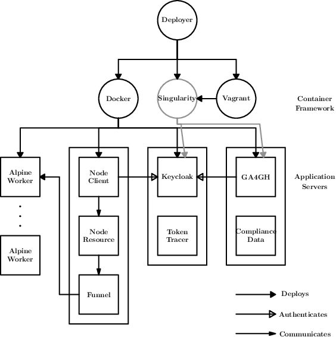

====================================
Overview
====================================

The deployer script is designed to support three types of container frameworks in the deployment of several parts of CanDIG's infrastructure:

1. Docker
2. Singularity
3. Vagrant

The parts of CanDIG supported by this script are as follows:

1. Keycloak
2. GA4GH Server (authentication branch)
3. Funnel (with funnel nodeJS authentication support servers)

Docker is the primary and preferred means of deployment, and has the most supported infrastructure. Vagrant is used as to support Singularity deployment on machines that cannot support Singularity themselves. 

The following image depicts the deployment scheme for the program:

As shown, the deployer selects from among the three available container frameworks. Each of these then supports the deployment of various parts of the available infrastructure. One can see that there are three primary software containers, each delegated amongst either Keycloak, GA4GH, or Funnel. Each of these containers also holds other support servers, tools, and data that may be configured based on the command-line arguments provided to the deployer program. For instance, we may choose whether to load test data onto the GA4GH server, or deploy the token tracer logging tool with the Keycloak server.